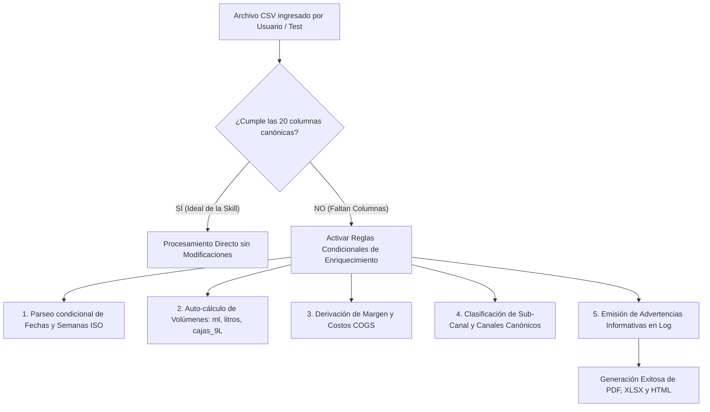

# Diagnóstico y Comparativa de Esquemas: Datos Reales del Cliente vs. Skill Reporte Loco Tequila

Este documento detalla el análisis estructural de los archivos entregados por el cliente en comparación con los esquemas de datos esperados por el motor de análisis y generación de reportes (`scripts/data_processor.py` y `generate_report.py`), así como las **recomendaciones condicionales para pruebas generales** cuando se ingresen datasets en bruto donde falten columnas requeridas.

---

## 1. Resumen Ejecutivo de Hallazgos

| Archivo del Cliente | Rol en la Skill | Estado de Compatibilidad | Columnas Faltantes Clave / Acciones Requeridas |
| :--- | :--- | :--- | :--- |
| **`Reportes de ventas 2026 semana 33 clean.xlsx`** | Ventas Reales (*Actuals*) | **Requiere Enriquecimiento / Mapeo** | • Falta `anio`, `ml_botella`, `litros`, `cajas_9L`, `categoria_o_linea`.<br>• Falta **`margen_pct`** y **`margen_pesos`** (no vienen costos en la factura).<br>• Falta **`sub_canal`** (Tradicional vs Moderno).<br>• Formato de semana es `"Semana 01"` (requiere `"2026-W01"`).<br>• Solo contiene 2026 (semanas 1-33); no hay histórico 2025 para YoY/Rolling 52. |
| **`Plan presupuesto de venta LT Semanalizado 2026 clean.xlsx`** | Presupuesto (*Plan*) | **Requiere Agregación y Homologación** | • Falta `anio`, `semana de venta` (`"YYYY-Www"`), `fecha_lunes`.<br>• Falta normalizar nombres de `ARTÍCULO` a `SKU/producto` canónico.<br>• Falta normalizar `CANAL` a `canal_reporte`.<br>• `plan_margen_pesos` y `plan_cajas_9L` deben derivarse (`Venta Neta - COGS Total` y `Unidades * ml / 9000`).<br>• Requiere agregación por `(semana, producto, canal)`. |

---

## 2. Análisis Detallado: Ventas Reales (Actuals)

### 2.1. Comparativa Columna por Columna
El motor de la skill espera **20 columnas** en `loco_actuals_enriquecido.csv`. El archivo del cliente (`Reportes de ventas 2026 semana 33 clean.xlsx`) contiene **26 columnas** procedentes de un extracto de facturación fiscal.

| # | Columna Esperada (`loco_actuals_enriquecido.csv`) | ¿Presente en Cliente? | Columna Origen Cliente | Tipo / Transformación Necesaria |
| :---: | :--- | :---: | :--- | :--- |
| 1 | **`semana de venta`** | ⚠️ Formato distinto | `Semana` (`"Semana 01"`) | Convertir a formato ISO: `"2026-W01"`. |
| 2 | **`fecha de venta`** | ✅ Sí | `Fecha de Emisión` | Ya viene en formato fecha (`2026-01-02`). |
| 3 | **`SKU/producto`** | ⚠️ Homologar | `SKU` | Homologar nombres (ej. `"loco 269"` $\rightarrow$ `"Loco 269"`, `"Loco Áureo Elevacion"` $\rightarrow$ `"Loco Aureo"`, estuches con copas $\rightarrow$ SKU base). |
| 4 | **`unidades_de_venta`** | ✅ Sí | `Unidades` | Entero / numérico. |
| 5 | **`categoria_o_linea`** | ❌ **FALTA** | *Ninguna* | Clasificar según SKU: `"Blanco"`, `"Ámbar"`, `"Puro Corazón"`, `"Áureo"`, etc. |
| 6 | **`cliente`** | ✅ Sí | `Cliente` | Nombre comercial del cliente (o `Receptor` como fallback). |
| 7 | **`canal`** | ✅ Sí | `Canal` | Canal comercial original. |
| 8 | **`region_o_estado`** | ⚠️ Homologar | `Ubicación` | Corregir inconsistencias de captura (ej. `"Quetetaro"` $\rightarrow$ `"Queretaro"`). |
| 9 | **`precio_unitario`** | ✅ Sí | `Importe` | Precio antes de impuestos. |
| 10 | **`venta_con_impuestos`** | ✅ Sí | `Monto` o `Venta + IVA` | Monto bruto facturado. |
| 11 | **`venta_sin_impuestos`** | ✅ Sí | `Venta` | Monto neto facturado antes de IEPS e IVA. |
| 12 | **`anio`** | ❌ **FALTA** | *Ninguna* | Extraer del año de `Fecha de Emisión` (`2026`). |
| 13 | **`ml_botella`** | ❌ **FALTA** | *Ninguna* | Asignar según catálogo de producto: `750` ml (mayoría) o `200` ml (`Loco 200`). |
| 14 | **`botellas`** | ✅ Sí | `Unidades` | Equivalente a `unidades_de_venta`. |
| 15 | **`litros`** | ❌ **FALTA** | *Ninguna* | Calcular: `botellas * ml_botella / 1000`. |
| 16 | **`cajas_9L`** | ❌ **FALTA** | *Ninguna* | Calcular: `litros / 9` = `botellas * ml_botella / 9000`. |
| 17 | **`margen_pct`** | ❌ **FALTA** | *Ninguna* | Margen porcentual. Se puede estimar o cruzar con el costo unitario (`COGS`) del archivo de Plan. |
| 18 | **`margen_pesos`** | ❌ **FALTA** | *Ninguna* | Margen en pesos: `venta_sin_impuestos * margen_pct` o `venta_sin_impuestos - (botellas * COGS_unitario)`. |
| 19 | **`sub_canal`** | ❌ **FALTA** | *Ninguna* | Clasificación requerida para el canal *Off Trade* (`"Tradicional"` vs `"Moderno"`) en tablas del PDF. |
| 20 | **`canal_reporte`** | ⚠️ Homologar | `Canal / Reporte` | Mapear a los 4 canales canónicos: `Off Trade`, `Centros de Consumo (On Trade)`, `Venta Directa`, `Familia y Amigos`. |

### 2.2. Columnas Adicionales del Archivo de Facturación (a descartar o filtrar)
El archivo real contiene columnas de control fiscal que no utiliza el reporte:
- `Mes`, `Folio fiscal`, `RFC`, `Receptor`, `IEPS`, `IVA`, `CECO Finanzas`, `CECO Datalap`, `Serie`, `Folio`, `Moneda`, `Medio`, `Fecha de cancelacion`.
- **Regla Crítica de Filtrado**: La columna `Estatus` contiene registros con valor `'Cancelado'` (con 0 unidades o ventas canceladas). **Deben filtrarse únicamente las filas con `Estatus == 'Vigente'`** (420 de 430 filas).

---

## 3. Análisis Detallado: Plan / Presupuesto Semanalizado

### 3.1. Comparativa Columna por Columna
El formato esperado `loco_actual_vs_plan_semanal.csv` contiene el presupuesto semanalizado a nivel canal y producto. El archivo del cliente (`Plan presupuesto de venta LT Semanalizado 2026 clean.xlsx`) contiene 22,064 filas desagregadas por vendedor, cliente y región.

| Columna Requerida en Plan | ¿Presente en Archivo Cliente? | Columna Origen Cliente | Regla / Transformación |
| :--- | :---: | :--- | :--- |
| **`anio`** | ❌ Falta | *Ninguna* | Asignar constante `2026`. |
| **`semana de venta`** | ⚠️ Distinto formato | `SEMANA` (`1..53`) | Convertir a ISO: `f"2026-W{SEMANA:02d}"`. |
| **`fecha_lunes`** | ❌ Falta | *Ninguna* | Calcular la fecha del lunes correspondiente a la semana ISO. |
| **`SKU/producto`** | ⚠️ Requiere Mapeo | `ARTÍCULO` | Homologar nombres largos en mayúsculas:<br>• `'LOCO TEQUILA BLANCO 750 ML'` $\rightarrow$ `'Loco Blanco'`<br>• `'LOCO TEQUILA REPOSADO ÁMBAR 750 ML'` $\rightarrow$ `'Loco Ambar'`<br>• `'LOCO TEQUILA PURO CORAZÓN 750 ML'` $\rightarrow$ `'Puro Corazon'`<br>• `'LOCO TEQUILA AÑEJO ÁUREO 750 ML'` $\rightarrow$ `'Loco Aureo'`<br>• `'LOCO TEQUILA BLANCO 200 ML'` $\rightarrow$ `'Loco 200'` |
| **`canal`** | ⚠️ Requiere Mapeo | `CANAL` | Homologar: `'OFF TRADE'` $\rightarrow$ `'Off Trade'`, `'ON TRADE'` $\rightarrow$ `'Centros de Consumo (On Trade)'`, `'VD'` / `'VENTA DIRECTA'` $\rightarrow$ `'Venta Directa'`. |
| **`canal_reporte`** | ⚠️ Requiere Mapeo | `CANAL` | Mapeo canónico a `CANAL_ORDER`. |
| **`plan_unidades`** / **`plan_botellas`** | ✅ Sí | `UNIDADES` | Suma de unidades presupuestadas. |
| **`plan_venta_sin_impuestos`** | ✅ Sí | `VENTA NETA (MXN)` | Suma de ventas netas sin impuestos presupuestadas. |
| **`plan_margen_pesos`** | ⚠️ Calculable | `VENTA NETA (MXN)` y `COGS TOTAL (MXN)` | Calcular: `[VENTA NETA (MXN)] - [COGS TOTAL (MXN)]`. |
| **`plan_cajas_9L`** | ⚠️ Calculable | `UNIDADES` y `ml_botella` | Calcular: `UNIDADES * ml_botella / 9000`. |
| **`plan_venta_con_impuestos`** | ⚠️ Opcional | Estimable | Estimar con factor de impuestos o `plan_venta_sin_impuestos * 1.53` (IEPS + IVA). |

---

## 4. Brechas de Negocio y Consideraciones Críticas

### 4.1. Ausencia de Histórico de Años Anteriores (2022-2025)
- **Situación**: El archivo de ventas reales del cliente solo abarca de la **Semana 01 a la Semana 33 de 2026** (420 transacciones vigentes). El dataset de muestra (`loco_actuals_enriquecido.csv`) cuenta con 59,778 registros de 2022 a 2026.
- **Impacto en el Reporte**:
  - Las comparativas **YoY (vs Misma Semana Año Anterior)**, **YTD vs Año Anterior** y **Rolling 52 Semanas** mostrarán variaciones de $0$ o $100\%$ si no se incorpora un archivo histórico con las ventas de 2025.
  - En las gráficas semanales, la línea de referencia de año anterior (*Last Year Line*) no tendrá datos previos para graficar.
- **Recomendación**: Solicitar al cliente el histórico de ventas de 2025 (o un consolidado 2025-2026) con la misma estructura.

### 4.2. Margen de Ganancia en Ventas Reales (COGS / Costo de Venta)
- **Situación**: Las facturas de venta del cliente contienen el precio de venta e impuestos, pero **no incluyen el costo de producto (COGS)** ni el margen.
- **Solución Automática**:
  - El archivo de Plan (`Plan presupuesto...clean.xlsx`) sí contiene la columna `COGS` unitario por artículo y cliente.
  - Se puede construir una tabla maestra de costo unitario por SKU a partir del Plan y cruzarla con las ventas reales para derivar automáticamente `margen_pesos = venta_sin_impuestos - (botellas * COGS_unitario)` y `margen_pct = margen_pesos / venta_sin_impuestos`.

### 4.3. Clasificación de Sub-Canal (*Off Trade: Tradicional vs. Moderno*)
- **Situación**: La columna `sub_canal` no viene en los archivos del cliente. El PDF incluye páginas de desglose detallado donde *Off Trade* se subdivide en *Tradicional* (mayoristas/licoreros como La Europea, Bodegas Alianza) y *Moderno* (cadenas de autoservicio/departamentales como Liverpool, Palacio de Hierro, Walmart).
- **Solución**: Mapear el `sub_canal` a partir del catálogo de `Cliente` (ej. Palacio de Hierro, Liverpool $\rightarrow$ `Moderno`; Bodegas Alianza, La Europea, Mayoristas $\rightarrow$ `Tradicional`).

---

## 5. Tabla Resumen de Mapeo Directo y Fórmulas de Transformación

| Variable Destino | Fórmula / Regla de Extracción |
| :--- | :--- |
| `semana de venta` | `f"{Fecha de Emisión.year}-W{int(Semana.replace('Semana','')):02d}"` |
| `fecha de venta` | `Fecha de Emisión.strftime('%Y-%m-%d')` |
| `SKU/producto` | `sku_mapping.get(SKU, SKU)` (Normalización a catálogo canónico) |
| `unidades_de_venta` | `Unidades` (filtrando `Estatus == 'Vigente'`) |
| `cliente` | `Cliente` (o `Receptor` si `Cliente` está vacío) |
| `canal` | `Canal` |
| `canal_reporte` | `canal_mapping.get(Canal / Reporte, 'Off Trade')` |
| `region_o_estado` | `Ubicación.replace('Quetetaro', 'Queretaro')` |
| `precio_unitario` | `Importe` |
| `venta_sin_impuestos` | `Venta` |
| `venta_con_impuestos` | `Monto` |
| `anio` | `Fecha de Emisión.dt.year` |
| `ml_botella` | `200` si '200' en SKU, sino `750` |
| `botellas` | `Unidades` |
| `litros` | `botellas * ml_botella / 1000.0` |
| `cajas_9L` | `litros / 9.0` |
| `margen_pct` | `(venta_sin_impuestos - costo_total) / venta_sin_impuestos` (o default `0.60`) |
| `margen_pesos` | `venta_sin_impuestos * margen_pct` |
| `sub_canal` | Regla por cliente para Off Trade (`'Moderno'` o `'Tradicional'`) |

---

## 6. Recomendaciones Condicionales (Si y Solo Si Faltan Columnas al Ingresar CSVs)

Para asegurar la robustez del sistema durante **pruebas generales y simulaciones con archivos brutos**, manteniendo intacto el estándar ideal de la skill, se establecen las siguientes recomendaciones de validación, diagnóstico y auto-completado:



### 6.1. Principio Rector: El Estándar Original vs. Pruebas Generales
1. **El Ideal de la Skill (Producción)**: El motor analítico espera datasets completamente enriquecidos (`loco_actuals_enriquecido.csv` de 20 columnas y `loco_actual_vs_plan_semanal.csv` de 21 columnas). Esto garantiza 100% de consistencia en todas las páginas del PDF, hojas analíticas del Excel y KPIs dinámicos del Dashboard HTML.
2. **Salvaguarda para Pruebas Generales**: Si el usuario o el entorno de pruebas provee un CSV que carece de alguna columna, el sistema **no debe abortar la ejecución**, sino aplicar reglas de imputación y derivación **únicamente sobre las columnas ausentes**.

---

### 6.2. Reglas Condicionales de Auto-Completado (Columna por Columna)

#### A. Si y solo si falta `semana de venta` o tiene formato no estándar:
- **Condición**: `semana de venta` no existe o no coincide con el patrón `^\d{4}-W\d{2}$`.
- **Acción**:
  - Si existe `fecha de venta` o `Fecha de Emisión`: Calcular semana ISO con `dt.isocalendar().week` y año `dt.isocalendar().year` $\rightarrow$ `f"{year}-W{week:02d}"`.
  - Si existe columna `Semana` (ej. `"Semana 01"` o entero `1`): Extraer número y combinar con el año del reporte $\rightarrow$ `f"{anio}-W{int(num):02d}"`.
- **Log / Alerta**: `[INFO] Columna 'semana de venta' auto-generada a partir de fecha/semana local.`

#### B. Si y solo si falta `anio`:
- **Condición**: `anio` no está en las columnas del CSV.
- **Acción**: Extraer del año de `fecha de venta` (`dt.year`). Si no hay fecha, tomar el argumento CLI `--anio`.
- **Log / Alerta**: `[INFO] Columna 'anio' asignada automáticamente: {anio}.`

#### C. Si y solo si faltan `ml_botella`, `litros` o `cajas_9L`:
- **Condición**: Columnas volumétricas ausentes.
- **Acción**:
  - `ml_botella`: Asignar `200` si el nombre del SKU contiene `"200"`; en cualquier otro caso asignar `750` (formato estándar de botella tequilera).
  - `litros`: Calcular `botellas * ml_botella / 1000.0`.
  - `cajas_9L`: Calcular `litros / 9.0` (factor estándar de la industria tequilera / CRT de 9 litros por caja de 12 botellas de 750 ml).
- **Log / Alerta**: `[INFO] Volúmenes (ml_botella, litros, cajas_9L) calculados dinámicamente mediante catálogo de producto.`

#### D. Si y solo si faltan `margen_pesos` o `margen_pct`:
- **Condición**: No existen columnas de margen ni costos en el archivo de ventas.
- **Acción**:
  - *Prioridad 1 (Si existe archivo de Plan con COGS)*: Cruzar el SKU vendido con el costo unitario `COGS` del archivo de Plan y calcular:
    $$\text{margen\_pesos} = \text{venta\_sin\_impuestos} - (\text{botellas} \times \text{COGS\_unitario})$$
    $$\text{margen\_pct} = \frac{\text{margen\_pesos}}{\text{venta\_sin\_impuestos}} \times 100$$
  - *Prioridad 2 (Fallback si no hay COGS disponible)*: Aplicar margen objetivo histórico del 60.0% (`margen_pct = 0.60`, `margen_pesos = venta_sin_impuestos * 0.60`).
- **Log / Alerta**: `[ADVERTENCIA] 'margen_pesos' no provisto; se estimó utilizando COGS del plan (o margen de referencia 60%).`

#### E. Si y solo si falta `sub_canal`:
- **Condición**: `sub_canal` no está definido (necesario para las tablas detalladas de Off Trade en el PDF).
- **Acción**:
  - Para registros con `canal == 'Off Trade'`:
    - Si el `cliente` coincide con autoservicios/departamentales (*Palacio de Hierro, Liverpool, Walmart, Soriana, Chedraui, City Market, Costco, Sams*): asignar `'Moderno'`.
    - Si el `cliente` es mayorista, distribuidor o licorería (*La Europea, Bodegas Alianza, Vinos América, Cava Sautto, Mayoristas*): asignar `'Tradicional'`.
  - Para otros canales (*On Trade, Venta Directa, Familia y Amigos*): asignar `np.nan` o el mismo valor del canal.
- **Log / Alerta**: `[INFO] 'sub_canal' inferido por reglas de cliente en Off Trade.`

#### F. Si y solo si falta `categoria_o_linea`:
- **Condición**: `categoria_o_linea` ausente.
- **Acción**: Derivar por patrón de texto en el SKU (`'Blanco'`, `'Ámbar'`, `'Puro Corazón'`, `'Áureo'`, `'269'`, `'200'`).

#### G. Si y solo si falta histórico de años anteriores (ej. solo hay 2026):
- **Condición**: El dataset contiene únicamente el año actual (`df['anio_num'].nunique() == 1`).
- **Acción**:
  - Las funciones comparativas (`YoY`, `Rolling 52`, `YTD vs LY`) deben devolver `0.0` o `None` de forma segura sin lanzar errores de división por cero o arrays vacíos.
  - En los gráficos de Chart.js y ReportLab, las líneas/áreas de "Año Anterior" deben omitirse limpiamente (valores `null` para que no caigan a cero ni distorsionen la visualización).
- **Log / Alerta**: `[ADVERTENCIA] Dataset sin histórico del año anterior. Comparativos YoY y Rolling 52 se mostrarán como N/D.`

---

### 6.3. Arquitectura Recomendada: Script ETL Desacoplado (`scripts/transform_client_data.py`)

Para no alterar el motor central de la skill (`data_processor.py`) y preservar el estándar de datos canónico, se recomienda implementar un script puente de enriquecimiento:

1. **Ubicación**: [scripts/transform_client_data.py](file:///E:/Users/1167486/Local/scripts/data_analytics_science/tequila_loco/skill_reporte/scripts/transform_client_data.py)
2. **Entradas**: Acepta archivos `.xlsx` o `.csv` brutos de clientes desde `--input-dir datos_reales_cliente`.
3. **Salidas**: Genera automáticamente los dos CSVs estándar en una carpeta de trabajo (ej. `data_clean_for_reports/`):
   - `loco_actuals_enriquecido.csv`
   - `loco_actual_vs_plan_semanal.csv`
4. **Flujo de Ejecución en una Sola Línea**:

```powershell
# 1. Transformar y enriquecer datos del cliente
python scripts/transform_client_data.py --input-dir datos_reales_cliente --output-dir data_clean_for_reports

# 2. Generar el reporte completo (PDF + XLSX + HTML) para la Semana 33 de 2026
python scripts/generate_report.py --semana 33 --anio 2026 --datos-dir data_clean_for_reports --output-dir output
```
